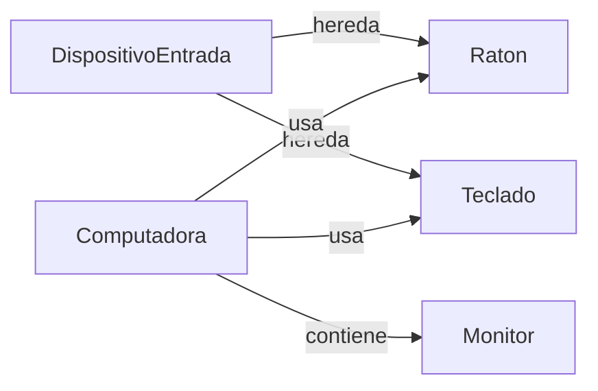
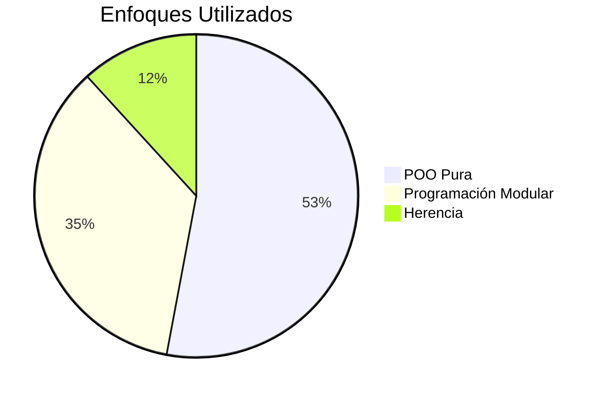

# 💻 MundoPC - Sistema de Gestión de Computadoras

> *"Sistema educativo para gestión de componentes de computadoras demostrando principios fundamentales de POO"*

## 🌟 Características Principales
- 🧩 **Programación modular** bien estructurada
- 🏗️ **Orientación a Objetos** pura (Abstracción, Encapsulamiento)
- 👨‍👦 **Herencia** entre clases (`DispositivoEntrada` → `Raton`, `Teclado`)
- 📦 **Relaciones de agregación** (`Computadora` contiene `Monitor`, `Raton`, etc.)
- 📊 **Sobrecarga de métodos** para flexibilidad

## 🔄 Flujo de Relaciones entre Clases

## 🛠️ Metodologías de Desarrollo

